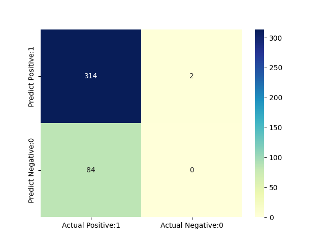
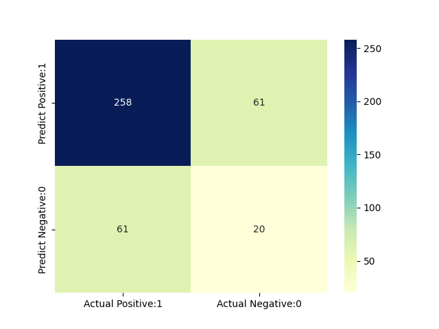

# minesweeper

Guy Bennevat Haninovich, Emma Tuhabonye  
COMP343 - Final Project  
May 11, 2022  
Random Forest versus Naive Bayes Implementations  

*INTRODUCTION*  

To play minesweeper, each game starts with a grid of unmarked squares. The game begins once the player makes their first guess. Since the player has no information to base this guess on, the first move is always safe. As the player clicks on the squares, numbers, revealing how many bombs are in a three by three grid surrounding the given tile, are revealed and some tiles remain unmarked. The goal is to select all of the “safe” tiles without selecting a tile containing a mine.
The goal of our project is to determine which model decides the best next move in a minesweeper game. To do this we train a Random Forest algorithm and Naive Bayes algorithm to calculate whether a tile is safe or not and choose the best tile for the next move. The Naive Bayes Classification algorithm is a supervised learning algorithm that makes naive assumptions regarding the probabilistic independence between target classes. The algorithm is based on Bayes’ Theorem and performs well with large datasets, well separated categories, and at a low computational cost. We decided to implement the Naive Bayes algorithm since we are attempting to classify tiles into two well separated categories as well as having an algorithm that could handle different board sizes with varying mine densities. The Random Forest algorithm is a classification algorithm that consists of many decision trees. It uses feature randomness and bootstrap aggregation to create a “forest” of uncorrelated decision trees and then predicts that class that is most predicted by the trees within the forest. This group prediction is more accurate than the prediction of any one tree. In our implementations of Naive Bayes and Random Forest we used the scikit-learn python library.

We compared the two models with their precision, recall, accuracies, and F1 scores. 
	
*SAMPLE*  

Our sample was randomly generated minesweeper games. Each board generated was 24x20 and had 99 mines. In each game we made a dataframe of the board with a random first move. Our features are Coordinates, X Coordinate, Y Coordinate, Values, and Neighbors. Our target variable is Safe. 

*METHODS*

To increase the size of our datasets for testing and training we gave the algorithms a 24 x 20 board with 99 mines. For simplicity purposes, the figures here will represent a 5 x 5 board with 5 mines. First, we generated a random 24 x 20 minesweeper game. To aid feeding in the randomized minesweeper data into a dataset, we created 3 matrices. The first matrix indicates the values on the board. The values of  -1 indicate that tile had yet to be uncovered. 

*Figure 1: Board Matix*

The other values on the board explain how many mines are touching the tile. We then generated a matrix where all the mines are ( “1” signifying that a mine while “0” signifies no mine.

*Figure 2: Mine Matrix*

The neighbors matrix shows the full uncovered board (Figure 3). The values in the third matrix show the entire board’s values including tiles with mines.
*Figure 3: Neighbor Matrix*

 From the above matrices we created the dataframe we would input into our algorithms. Our dataset included the features: Coordinates, which was the square in the game grid, the x and y coordinate, the values which were how many mines were touching that square, and the neighbors of the coordinate. Our target variable was the “Safe” which was denoted by a “1” for not safe and a “0” for safe. We generated a 24 x 20 board with a random first move made, used that for training, and then took the same board, made a random second (safe) move, and used that for testing.
 
*RESULTS*

We created a confusion matrix to evaluate the performance of both the Random Forest model and the Naive Bayes model. The matrix will compare the values of those predicted by the models. We do this to see the kinds of errors it is making and if the models are better at predicting if a square is safe or not. For both models, positive is not safe and negative is safe. The precision is the proportion of all the positive or negative predictions to the total predicted positive/negative. The Recall is the proportion of the correct positive predictions to the total positive/negative examples. The F1 score is the harmonic mean of precision and recall. 

The confusion matrix we ran using after using the Naive Bayes classifier found that the classifier would tend to predict a square that had a mine (“1”)  the most. The most mistakes the model made was when it predicted a square was safe but the square was actually not safe. The proportion of mine identifications that was actually correct was .99. The proportion of correct “not safe” square predictions to the total “not safe” square guesses is .81. Because there were so few safe squares that were not already identified for this board,  the data is skewed. Thus, we cannot make a conclusion on how well the Naive Bayes model identifies safe squares. 
	
*Figure 4: Naive Bayes Confusion Matrix*

*Figure 5: Precision, Recall, and F1 Score for Naive Bayes*

The confusion matrix we ran after running the Random Forest Model also demonstrates that the model would predict that a square was not safe the most (Figure 6). The proportion of correctly predicted cases that were not safe was .81 and the proportion of correctly identified predicted cases that were safe was .25 (Figure 7). The proportion of correct not safe square predictions to the total not safe square guesses is .81. The proportion of safe square predictions to the total of safe guesses is .25. Since there is no large gap in the precision and recall there is no need for the F1 score here.

*Figure 6: Confusion Matrix for Random Forest Model*

*Figure 7: Precision, Recall, and F1 Score for Random Forest Model*

*CONCLUSION* 

Our goal was to determine the best model to determine if a square is safe or not to click. We found that the Random Forest model would be best to determine this because it had higher recall. Accuracy would not be the best evaluation statistic for our model because of how skewed our data is. Many of the time the amount of safe squares that were not already uncovered was very small. 

A limitation to our project was the lack of data. Because the minesweeper game was 24 x 20, our data only had 400 observations. Since Naive Bayes needs many observations for more accurate predictions, 400 was not enough for it to perform as well as the Random Forest model.
Another method that we could have chosen would be a reinforcement learning method. The way a reinforcement learning method works is it plays the game repeatedly and gets rewarded for each time it picks a mine free square. The reward can also be increased for squares that give more information. We were unable to use the reinforcement learning method because with the time frame of the project that would have been too great of a task to teach ourselves. Wanting and excited to try something with minesweeper, we landed on using supervised learning techniques to learn the next best move. 

